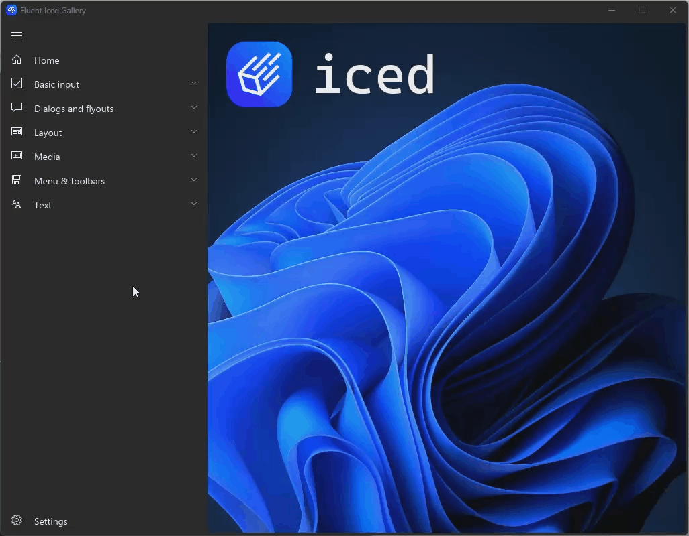

# Fluent Iced Gallery

A small app inspired by the [WinUI 3 Gallery] which uses [Iced], a cross-platform GUI library written in Rust. It showcases a sample of widgets styled according to fluent design principles and served as an excuse to learn Rust and Iced.

It demonstrates how well Iced can be used to create a desktop app in this style, and, just as importantly, highlights what is currently lacking due to its experimental status.

 

[WinUI 3 Gallery]: https://github.com/microsoft/WinUI-Gallery
[Iced]: https://github.com/iced-rs/iced